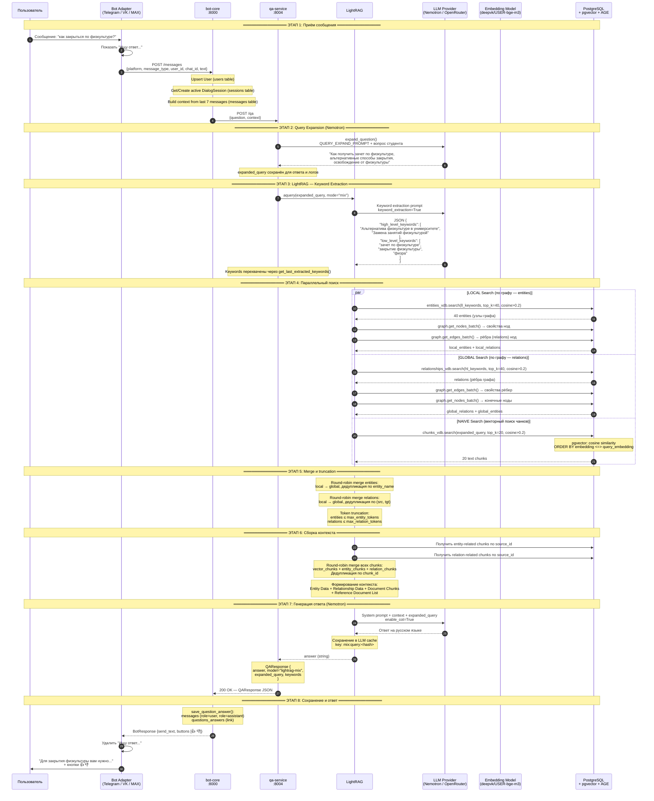

# Пайплайн обработки запроса пользователя

## Sequence Diagram

---

## Подробное описание каждого этапа

### Этап 1: Приём сообщения

**Участники:** User → Bot Adapter → bot-core

1. Пользователь отправляет текстовое сообщение через мессенджер (Telegram / VK / MAX).
2. Bot Adapter (отдельный процесс/контейнер) получает update от платформы, нормализует его в единый формат `IncomingMessage` и отправляет `POST /messages` в bot-core.
3. bot-core делает `upsurt_user()` — создаёт или обновляет запись в таблице `users`.
4. bot-core получает или создаёт активную `DialogSession` (таблица `sessions`, state=`DIALOG`).
5. bot-core собирает контекст из последних N сообщений (по умолчанию 7) из таблицы `messages` — формат `"Пользователь: ...\nБот: ..."`.
6. bot-core вызывает `QAServiceClient.ask(question, context)` → `POST /qa` в qa-service.

### Этап 2: Query Expansion (Nemotron)

**Участники:** qa-service → LLM Pool → OpenRouter (Nemotron)

1. qa-service вызывает `expand_question(question)` — отправляет вопрос в LLM Pool.
2. LLM Pool (приоритет: openrouter → gigachat → mistral) выбирает доступного провайдера — OpenRouter с моделью `nvidia/nemotron-3-super-120b-a12b:free`.
3. LLM получает промпт `QUERY_EXPAND_PROMPT` с инструкцией преобразовать неформальный вопрос в формальный расширенный запрос с синонимами.
4. **Результат:** неформальный вопрос «как закрыться по физкультуре?» → расширенный запрос «Как получить зачет по физкультуре, альтернативные способы закрытия, освобождение от физкультуры».
5. При ошибке/таймауте — fallback на оригинальный вопрос.

### Этап 3: LightRAG — Keyword Extraction

**Участники:** qa-service → LightRAG → LLM (Nemotron/OpenRouter)

1. qa-service вызывает `rag.aquery(expanded_query, param=QueryParam(mode="mix"))`.
2. LightRAG внутри `kg_query()` вызывает `get_keywords_from_query()` — отправляет расширенный запрос в LLM с флагом `keyword_extraction=True`.
3. LLM возвращает JSON с двумя списками:
   - **high_level_keywords** — общие темы и концепции (используются для поиска по relations/рёбрам графа).
   - **low_level_keywords** — конкретные сущности, термины, имена (используются для поиска по entities/нодам графа).
4. Если extraction не удался — fallback: `low_level_keywords = [оригинальный запрос]`.
5. **Перехват:** `_log_keywords_if_extraction()` в `lightrag_adapter.py` парсит JSON-ответ и сохраняет keywords через `get_last_extracted_keywords()`.

### Этап 4: Параллельный поиск

**Участники:** LightRAG → PostgreSQL (pgvector + AGE)

Три ветки поиска выполняются параллельно:

#### LOCAL Search (по entities/нодам графа)
1. `entities_vdb.search(ll_keywords, top_k=40, cosine_threshold=0.2)` — векторный поиск по таблице эмбеддингов сущностей с low_level_keywords как запросом.
2. Для найденных entities — получение их свойств из AGE-графа (`get_nodes_batch`).
3. Получение рёбер (relations) этих нод (`get_edges_batch`).

#### GLOBAL Search (по relations/рёбрам графа)
1. `relationships_vdb.search(hl_keywords, top_k=40, cosine_threshold=0.2)` — векторный поиск по таблице эмбеддингов отношений с high_level_keywords как запросом.
2. Для найденных relations — получение свойств рёбер из AGE-графа.
3. Получение конечных нод (endpoint entities).

#### NAIVE Search (векторный поиск по чанкам)
1. `chunks_vdb.search(expanded_query, top_k=20, cosine_threshold=0.2)` — классический RAG-поиск: cosine similarity между эмбеддингом запроса и эмбеддингами текстовых чанков.
2. Возвращает топ-20 релевантных фрагментов документов.

### Этап 5: Merge и Truncation

**Участники:** LightRAG (в памяти)

1. **Entities merge:** round-robin с чередованием local/global, дедупликация по `entity_name`.
2. **Relations merge:** round-robin с чередованием local/global, дедупликация по паре `(source, target)`.
3. **Token truncation:** обрезка entities и relations до лимитов `max_entity_tokens` и `max_relation_tokens`.

### Этап 6: Сборка контекста

**Участники:** LightRAG → PostgreSQL

1. Для каждой entity/relation — получение исходных текстовых чанков (chunk_id → source_id).
2. **Merge chunks:** round-robin из трёх источников:
   - `vector_chunks` (из NAIVE поиска)
   - `entity_chunks` (chunks, связанные с entities)
   - `relation_chunks` (chunks, связанные с relations)
3. Дедупликация по `chunk_id`.
4. Формирование финальной строки контекста по шаблону `kg_query_context`:
   - Knowledge Graph Data (Entity)
   - Knowledge Graph Data (Relationship)
   - Document Chunks
   - Reference Document List

### Этап 7: Генерация ответа

**Участники:** LightRAG → LLM (Nemotron/OpenRouter)

1. LightRAG отправляет в LLM: system_prompt + собранный контекст + расширенный запрос пользователя.
2. LLM (Nemotron через OpenRouter) генерирует ответ на русском языке.
3. Результат кэшируется в `lightrag_llm_cache` по ключу `mix:query:<hash>`.
4. `aquery()` возвращает строку ответа.

### Этап 8: Сохранение и ответ пользователю

**Участники:** qa-service → bot-core → Bot Adapter → User

1. qa-service возвращает `QAResponse` с полями: `answer`, `model`, `expanded_query`, `keywords`.
2. bot-core сохраняет в БД:
   - `messages` (role=`user`): вопрос пользователя.
   - `messages` (role=`assistant`): ответ бота.
   - `questions_answers`: связь вопроса с ответом.
   - Обновляет `sessions.last_message_at`.
3. bot-core возвращает `BotResponse` с текстом ответа и inline-кнопками 👍 👎.
4. Bot Adapter удаляет сообщение «Ищу ответ...» и отправляет ответ пользователю.

---

## Сводка по LLM-вызовам

| Вызов | Модель | Провайдер | Таймаут | Назначение |
|---|---|---|---|---|
| Query Expansion | Nemotron 3 Super | OpenRouter | 60s | Расширение неформального вопроса |
| Keyword Extraction | Nemotron 3 Super | OpenRouter | 120s | Извлечение HL/LL ключевых слов |
| Answer Generation | Nemotron 3 Super | OpenRouter | 600s | Генерация финального ответа |
| *Индексация (отдельный процесс)* | *Qwen 3.6:35b* | *Ollama* | *180–600s* | *Экстракция entities/relations* |

## Архитектура хранения

| Данные | Хранилище | Технология |
|---|---|---|
| Текстовые чанки + эмбеддинги | `lightrag_vdb_chunks_*`, `lightrag_doc_chunks` | pgvector (cosine similarity) |
| Entities + эмбеддинги | `lightrag_vdb_entity_*`, `lightrag_full_entities` | pgvector + AGE graph |
| Relations + эмбеддинги | `lightrag_vdb_relation_*`, `lightrag_full_relations` | pgvector + AGE graph |
| Граф знаний | AGE graph `chunk_entity_relation` | Apache AGE (PostgreSQL extension) |
| Документы | `lightrag_doc_full` | PostgreSQL |
| Статус индексации | `lightrag_doc_status` | PostgreSQL |
| LLM-кэш | `lightrag_llm_cache` | PostgreSQL |
| Пользователи, сессии, сообщения | `users`, `sessions`, `messages`, `questions_answers` | PostgreSQL |
