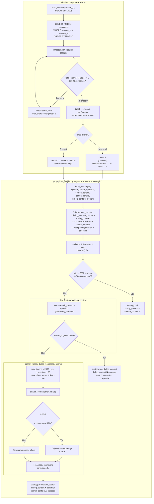
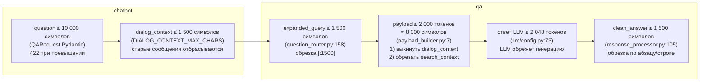

# Диалоговая логика QA-сервиса Вопрошалыч

## Архитектура обработки вопроса

```mermaid
flowchart TD
    subgraph CHATBOT["chatbot (bot-service)"]
        direction TB
        MSG_IN["Входящее сообщение<br/>Telegram / VK / MAX"]
        SESSION["get_or_create_active_session(user_id)<br/>dialog_service.py:21"]
        SESSION_OK{"Сессия<br/>найдена?"}
        NO_SESSION["ask_qa_service(question)<br/>context = None"]
        BUILD_CTX["build_context(session_id, max_chars=1500)<br/>dialog_service.py:93<br/>─────────────────<br/>SELECT messages ORDER BY id DESC<br/>Итерация от новых к старым<br/>Добавлять пока total ≤ 1500 символов<br/>Результат в хронологическом порядке<br/>─────────────────<br/>Формат: «Пользователь: …» / «Бот: …»"]
        CTX_RESULT{"history<br/>пустая строка?"}
        CTX_NONE["context = None"]
        CTX_HAS["context = history"]
        QA_CALL["POST http://qa:8004/qa<br/>{question, context?}<br/>X-Request-ID: uuid8"]

        MSG_IN --> SESSION --> SESSION_OK
        SESSION_OK -- "Нет" --> NO_SESSION --> QA_CALL
        SESSION_OK -- "Да" --> BUILD_CTX --> CTX_RESULT
        CTX_RESULT -- "''пусто" --> CTX_NONE --> QA_CALL
        CTX_RESULT -- "Непусто" --> CTX_HAS --> QA_CALL
    end

    QA_CALL -- "HTTP" --> ENTRY

    subgraph QA["qa (qa-service :8004)"]
        direction TB
        ENTRY["POST /qa<br/>QARequest {question ≤10000, context?}"]
        READY_CHECK{"LightRAG<br/>ready?"}
        ERR_503["HTTP 503<br/>LightRAG not initialized"]

        ENTRY --> READY_CHECK
        READY_CHECK -- "Нет" --> ERR_503
        READY_CHECK -- "Да" --> P1_CALL

        P1_CALL["classify_and_expand(question)<br/>question_router.py:38"]
        P1_PROMPT["LLM ← QUERY_CLASSIFY_EXPAND_PROMPT<br/>─────────────────<br/>Типы вопросов:<br/>1 — база знаний ТюмГУ<br/>2 — вопрос о самом боте<br/>3 — общий / поболтать / off-topic<br/>─────────────────<br/>Расширение:<br/>• Тип 1: сленг→формальный, синонимы<br/>• Тип 2,3: expanded = оригинал<br/>─────────────────<br/>Выход: JSON {type, expanded_query}"]
        P1_CALL --> P1_PROMPT --> P1_RESULT
        P1_CALL -. "Timeout/Ошибка →<br/>fail-safe: type=1<br/>expanded=оригинал" .-> ROUTE

        P1_RESULT["QuestionClassification<br/>{question_type, expanded_query}"]
        P1_LIM{"expanded_query<br/>≤ 1500 символов?"}
        P1_OK["expanded_query как есть"]
        P1_CUT["expanded_query[:1500]"]

        P1_RESULT --> P1_LIM
        P1_LIM -- "Да" --> P1_OK --> ROUTE
        P1_LIM -- "Нет" --> P1_CUT --> ROUTE

        ROUTE{"question_type?"}

        subgraph KB["Тип 1: База знаний"]
            direction TB
            KB_SEARCH["LightRAG search<br/>rag.aquery_data(expanded_query,<br/>mode=mix, top_k=8)<br/>─────────────────<br/>Гибридный поиск:<br/>• Векторный (embedding similarity)<br/>• Графовый (entity/relationship)<br/>• Score-based merge (patched)"]
            KB_SEARCH -. "Ошибка поиска →<br/>search_context = ''<br/>→ Ветка B" .-> KB_HAS_CTX
            KB_FORMAT["_format_search_context()<br/>─────────────────<br/>chunks → «--- Найденная информация ---»<br/>каждый с [источник N] если URL<br/>entities → «--- Сущности ---»<br/>relationships → «--- Связи ---»"]
            KB_HAS_CTX{"search_context.strip()<br/>не пустой?"}

            KB_SEARCH --> KB_FORMAT --> KB_HAS_CTX

            KB_HAS_CTX -- "Да" --> KB_W_SYS
            KB_HAS_CTX -- "Нет" --> KB_N_SYS

            subgraph KB_WITH_CTX["Ветка A: С контекстом из БЗ"]
                direction TB
                KB_W_SYS["system = SYSTEM_PROMPT_WITH_CONTEXT<br/>─────────────────<br/>• Оцени релевантность контекста<br/>• НЕ релевантен → скажи сразу<br/>• Релевантен → используй<br/>• Не придумывай инфо<br/>• Ссылки: «Подробнее: URL»<br/>• «Использованные источники: N»"]
                KB_W_BUILD["build_messages()<br/>payload_builder.py:16<br/>─────────────────<br/>user_content:<br/>1. DIALOG_CONTEXT_PROMPT + dialog_context<br/>2. «Контекст из БЗ:» + search_context<br/>3. «Вопрос студента:» + question"]
                KB_W_CHECK{"estimate_tokens(sys+user)<br/>≤ 2000 токенов (≈8000 символов)?"}

                KB_W_SYS --> KB_W_BUILD --> KB_W_CHECK
                KB_W_CHECK -- "Да: strategy=full" --> KB_W_LLM
                KB_W_CHECK -- "Нет" --> KB_W_TRUNCATE

                subgraph KB_W_TRUNCATE["Адаптивное сокращение payload"]
                    direction TB
                    TR1{"Убрать dialog_context<br/>≤ 2000 токенов?"}
                    TR1 -- "Да: strategy=no_dialog_context" --> KB_W_LLM
                    TR1 -- "Нет" --> TR2["Убрать dialog_context<br/>+ обрезать search_context<br/>strategy=truncated_search<br/>─────────────────<br/>max_tokens = 2000 − sys − question − 50<br/>max_chars = max_tokens × 4<br/>Обрезка по границе \\n---\\n<br/>если boundary > 50% max_chars<br/>+ «[...часть контекста опущена...]»"]
                    TR2 --> KB_W_LLM
                end

                KB_W_LLM["llm_pool.call(messages)<br/>max_tokens=2048<br/>─────────────────<br/>Fallback: Mistral → OpenRouter → GigaChat"]
            end

            subgraph KB_NO_CTX["Ветка B: Без контекста из БЗ"]
                direction TB
                KB_N_SYS["system = SYSTEM_PROMPT_NO_CONTEXT<br/>─────────────────<br/>• «нет инфо из БЗ — скажи прямо»<br/>• Общие советы — как личное мнение<br/>• Запрещено: придумывать адреса,<br/>  телефоны, email, имена<br/>• Распознавай сленг (физра, сессия)"]
                KB_N_BUILD["build_messages()<br/>payload_builder.py:16<br/>─────────────────<br/>user_content:<br/>1. DIALOG_CONTEXT_PROMPT + dialog_context<br/>2. «Вопрос студента:» + question<br/>(search_context отсутствует)"]
                KB_N_CHECK{"estimate_tokens(sys+user)<br/>≤ 2000 токенов?"}
                KB_N_LLM["llm_pool.call(messages)<br/>max_tokens=2048"]

                KB_N_SYS --> KB_N_BUILD --> KB_N_CHECK
                KB_N_CHECK -- "Да" --> KB_N_LLM
                KB_N_CHECK -- "Нет: убрать<br/>dialog_context" --> KB_N_LLM
            end
        end

        subgraph SYS["Тип 2: Вопрос о боте"]
            direction TB
            SYS_SYS["system = SYSTEM_PROMPT_ABOUT_BOT<br/>─────────────────<br/>Информация о Вопрошалыч:<br/>• Команда МОиАИС ТюмГУ<br/>• Технологии: LightRAG<br/>• Источники: utmn.ru, sveden, confluence<br/>• Возможности и ограничения"]
            SYS_BUILD["messages = [<br/>  {system: SYSTEM_PROMPT_ABOUT_BOT},<br/>  {user: question}<br/>]<br/>⚠️ Без dialog_context<br/>⚠️ Без search_context"]
            SYS_LLM["llm_pool.call(messages)"]

            SYS_SYS --> SYS_BUILD --> SYS_LLM
        end

        subgraph GEN["Тип 3: Общий вопрос"]
            direction TB
            GEN_SYS["system = SYSTEM_PROMPT<br/>─────────────────<br/>1. Приветствия/прощания:<br/>   → 1 короткое предложение<br/>2. Всё остальное:<br/>   → ровно 2 предложения<br/>   первое — комментарий<br/>   второе — возврат к ТюмГУ"]
            GEN_BUILD["messages = [<br/>  {system: SYSTEM_PROMPT},<br/>  {user: question}<br/>]<br/>⚠️ Без dialog_context<br/>⚠️ Без search_context"]
            GEN_LLM["llm_pool.call(messages)"]

            GEN_SYS --> GEN_BUILD --> GEN_LLM
        end

        ROUTE -- "type = 1" --> KB_SEARCH
        ROUTE -- "type = 2" --> SYS_SYS
        ROUTE -- "type = 3" --> GEN_SYS

        subgraph POST["Phase 3: Постобработка"]
            direction TB
            POST_CLEAN["process_llm_response()<br/>response_processor.py:130<br/>─────────────────<br/>1. clean_markdown() — убрать ## ** * списки<br/>2. Удалить «Использованные источники:»<br/>3. extract_links() — «Подробнее: URL» → sources[]<br/>4. format_answer(max_length=1500)<br/>─────────────────<br/>Обрезка ответа: если len > 1500:<br/>  ищем \\n\\n (абзац) > 70% длины<br/>  иначе \\n (строка) > 50%<br/>  иначе режем по 1500"]
            POST_SRC["_filter_used_sources()<br/>Парсит «Использованные источники: N»<br/>→ URL из source_index[N] → строго 1 URL"]
            POST_RESULT["QAResponse<br/>{answer, model, sources[0..1],<br/>expanded_query, keywords, question_type}"]

            POST_CLEAN --> POST_SRC --> POST_RESULT
        end

        KB_W_LLM --> POST_CLEAN
        KB_N_LLM --> POST_CLEAN
        SYS_LLM --> POST_CLEAN
        GEN_LLM --> POST_CLEAN
    end
```



## Сборка контекста диалога и адаптивное сокращение payload



## Карта лимитов



## Формат payload для LLM по веткам

### Ветка A: KB + найден контекст (основной сценарий)

```
messages = [
  {
    role: "system",
    content: SYSTEM_PROMPT_WITH_CONTEXT          // ~1 800 символов
  },
  {
    role: "user",
    content:
      "История текущего диалога приведена ниже.\n  // DIALOG_CONTEXT_PROMPT ~150 символов
       Используй её только как дополнительный контекст...
       Пользователь: ...                          // dialog_context, до 1 500 символов
       Бот: ...

       Контекст из базы знаний:                   // search_context, переменная длина
       --- Найденная информация ---
       [источник 1] Текст чанка...
       ---
       [источник 2] Текст чанка...
       --- Сущности ---
       Сущность: описание
       --- Связи ---
       A → B: описание

       Вопрос студента: <question>"               // оригинальный вопрос
  }
]
// Лимит: ~8 000 символов (2 000 токенов)
// При превышении: 1) выкинуть dialog_context  2) обрезать search_context
```

### Ветка B: KB + контекст НЕ найден

```
messages = [
  { role: "system", content: SYSTEM_PROMPT_NO_CONTEXT },  // ~1 500 символов
  {
    role: "user",
    content:
      "<DIALOG_CONTEXT_PROMPT>
       <dialog_context>             // до 1 500 символов

       Вопрос студента: <question>"
  }
]
// dialog_context присутствует (если передан из chatbot)
// search_context отсутствует
```

### Вопрос о боте (type=2)

```
messages = [
  { role: "system", content: SYSTEM_PROMPT_ABOUT_BOT },  // ~1 200 символов
  { role: "user",   content: question }                  // без контекста
]
```

### Общий вопрос (type=3)

```
messages = [
  { role: "system", content: SYSTEM_PROMPT },  // ~800 символов
  { role: "user",   content: question }        // без контекста
]
```

## Сводная таблица промтов

| Промт | Когда используется | Поиск в БЗ | Контекст диалога | Приоритет в payload |
|-------|--------------------|-------------|------------------|---------------------|
| `QUERY_CLASSIFY_EXPAND_PROMPT` | Всегда (Phase 1) | — | — | — |
| `SYSTEM_PROMPT_WITH_CONTEXT` | type=1 + есть результаты поиска | Да (mix) | Да, может быть выкинут | наименьший |
| `SYSTEM_PROMPT_NO_CONTEXT` | type=1 + нет результатов поиска | Пусто | Да, может быть выкинут | наименьший |
| `SYSTEM_PROMPT_ABOUT_BOT` | type=2 (вопрос о боте) | Нет | Нет | — |
| `SYSTEM_PROMPT` | type=3 (общий/поболтать) | Нет | Нет | — |
| `DIALOG_CONTEXT_PROMPT` | type=1 (обе ветки A и B) | — | Да (префикс) | отбрас. первым |
| `NO_DOCUMENT_DATA_RESPONSE` | Не используется в текущем коде | — | — | — |

## Таблица всех лимитов

| Лимит | Значение | Где | Что при превышении |
|-------|----------|-----|--------------------|
| question | 10 000 символов | QARequest (Pydantic) | 422 Validation Error |
| dialog_context (сборка) | 1 500 символов | chatbot config | Старые сообщения не попадают в контекст |
| expanded_query | 1 500 символов | question_router.py:158 | Обрезка `[:1500]` |
| payload для LLM | ~2 000 токенов (~8 000 символов) | payload_builder.py:7 | 1) выкинуть dialog_context → 2) обрезать search_context |
| ответ LLM (max_tokens) | 2 048 токенов | llm/config.py:73 | LLM обрежет генерацию |
| clean_answer | 1 500 символов | response_processor.py:105 | Обрезка по абзацу/строке |

## LLM Pool: Fallback-цепочка

```
mistral (open-mistral-nemo)
  → openrouter (nvidia/nemotron-3-super-120b-a12b:free)
    → gigachat
```

Приоритет задаётся `MODEL_PRIORITY` (по умолчанию: `mistral,openrouter`).
