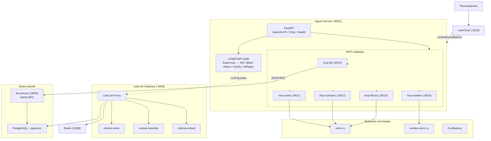

# Voproshalych v3 — Агент-ассистент ТюмГУ

Автономный AI-ассистент с собственной базой знаний, LangGraph-оркестратором и современным чат-интерфейсом.

## Архитектура



### Компоненты

| Компонент | Технология | Порт | Описание |
|-----------|-----------|------|----------|
| **LobeChat** | lobehub/lobe-chat | 3210 | Современный ChatGPT-like интерфейс |
| **agent-service** | FastAPI + LangGraph | 8001 | Оркестратор: классификация, маршрутизация, MCP-инструменты |
| **LiteLLM Gateway** | LiteLLM Proxy | 4000 | Прокси к Mistral API (3 модели + Redis-кэш) |
| **kb-service** | FastAPI + SQLAlchemy | 8005 | База знаний: парсинг, чанкинг, эмбеддинги, pgvector-поиск |
| **mcp-kb** | Python FastAPI | 9010 | Bridge к kb-service через JSON-RPC |
| **mcp-news** | Python FastMCP | 9011 | Парсинг новостей с utmn.ru |
| **mcp-contacts** | Python FastMCP | 9012 | Парсинг контактов utmn.ru |
| **mcp-library** | Python FastMCP | 9013 | Информация о библиотеке (bmk.utmn.ru) |
| **mcp-sveden** | Python FastMCP | 9014 | Сведения об организации (sveden.utmn.ru) |
| **PostgreSQL** | PostgreSQL + pgvector + AGE | 5433 | Основная БД с векторным поиском |
| **Redis** | Redis 7 | 6380 | Кэш LiteLLM |

### Интенты (LangGraph)

```
start → dialog_context → supervisor (классификация)
          ├─ kb_qa          → kb_workflow → end
          ├─ meta           → meta        → end
          ├─ tool_required  → react       → end
          ├─ clarify        → clarify     → end
          └─ off_topic      → off_topic   → end
```

| Интент | Описание |
|--------|----------|
| `kb_qa` | Вопрос про университет (правила, стипендии, факультеты...) |
| `meta` | Вопрос про самого ассистента |
| `tool_required` | Запрос, требующий MCP-инструментов (новости, контакты...) |
| `clarify` | Неясный запрос — просим уточнить |
| `off_topic` | Не по теме — вежливый отказ |

### LiteLLM модели

| Имя | Системная модель | Назначение |
|-----|-----------------|------------|
| `mistral-nemo` | `mistral/open-mistral-nemo` | Основной ответ (t=0.7, max_tokens=4096) |
| `mistral-classifier` | `mistral/open-mistral-nemo` | Классификация (t=0.1, max_tokens=512) |
| `mistral-embed` | `mistral/mistral-embed` | Эмбеддинги для pgvector (dim=1024) |

## Быстрый старт

### 1. Подготовка

```bash
cd Submodules/voproshalych_v2/v3
# .env уже есть — проверить MISTRAL_API_KEY
# При необходимости скопировать из docs/Environment/v2_local/.env
```

### 2. Запуск всех сервисов

```bash
docker compose up -d --build
```

Проверить статус:

```bash
docker compose ps
```

Ждать готовности:

```bash
# Проверить health всех сервисов
curl http://localhost:8001/health
# → {"status":"ok","service":"agent-service","version":"0.1.0"}

curl http://localhost:8005/health
# → {"status":"ok","service":"kb-service","version":"0.1.0"}

curl http://localhost:4000/health/readiness
# → {"status":"ok"}
```

### 3. Заполнение базы знаний

После запуска PostgreSQL и kb-service нужно наполнить базу знаний.

**Стандартные источники** (работают из Docker):

```bash
# Краулинг utmn.ru
curl -X POST http://localhost:8005/api/v1/tools \
  -H "Content-Type: application/json" \
  -d '{"jsonrpc":"2.0","method":"crawl_utmn","params":{"base_url":"https://www.utmn.ru"},"id":1}'

# Краулинг sveden.utmn.ru
curl -X POST http://localhost:8005/api/v1/tools \
  -H "Content-Type: application/json" \
  -d '{"jsonrpc":"2.0","method":"crawl_sveden","params":{},"id":1}'

# Краулинг FAQ
curl -X POST http://localhost:8005/api/v1/tools \
  -H "Content-Type: application/json" \
  -d '{"jsonrpc":"2.0","method":"crawl_utmn_faq","params":{"source_url":"https://www.utmn.ru"},"id":1}'

# Краулинг контактов
curl -X POST http://localhost:8005/api/v1/tools \
  -H "Content-Type: application/json" \
  -d '{"jsonrpc":"2.0","method":"crawl_utmn_contacts","params":{"source_url":"https://www.utmn.ru/kontakty"},"id":1}'
```

**Confluence** (Vouch SSO блокирует запросы из Docker на macOS — запускать с хоста, где есть VPN):

```bash
uv run --no-project python3 scripts/crawl_confluence.py                # все пространства
uv run --no-project python3 scripts/crawl_confluence.py --source study  # только Study
uv run --no-project python3 scripts/crawl_confluence.py --source help   # только Help
```

**Отдельный документ по URL:**

```bash
curl -X POST http://localhost:8005/api/v1/tools \
  -H "Content-Type: application/json" \
  -d '{"jsonrpc":"2.0","method":"store_document","params":{"url":"https://www.utmn.ru/some-page","source_type":"web"},"id":1}'
```

**Проверить поиск:**

```bash
curl -X POST http://localhost:8005/api/v1/tools \
  -H "Content-Type: application/json" \
  -d '{"jsonrpc":"2.0","method":"kb_search","params":{"query":"какие стипендии в тюмгу","top_k":5},"id":1}'
```

### 4. Запуск веб-интерфейса (LobeChat)

После запуска всех сервисов LobeChat доступен по адресу:

```
http://localhost:3210
```

Модель `mistral-nemo` подхватывается автоматически через OpenAI-совместимый API agent-service.

Проверить, что API работает:

```bash
# Список моделей
curl http://localhost:8001/v1/models

# Чат через OpenAI-совместимый эндпоинт
curl -X POST http://localhost:8001/v1/chat/completions \
  -H "Content-Type: application/json" \
  -d '{
    "model": "mistral-nemo",
    "messages": [{"role": "user", "content": "какие стипендии в тюмгу"}]
  }'

# Эмбеддинги
curl -X POST http://localhost:8001/v1/embeddings \
  -H "Content-Type: application/json" \
  -d '{"model":"mistral-embed","input":"Тюменский государственный университет"}'
```

### Полезные команды

```bash
# Логи всех сервисов
docker compose logs -f

# Логи конкретного сервиса
docker compose logs -f agent-service kb-service lobe-chat

# Пересобрать и перезапустить
docker compose up -d --build <service>

# Остановить
docker compose down

# Остановить с удалением томов (стерёт БД!)
docker compose down -v
```

## Структура

```
v3/
├── docker-compose.yml          # Единый Compose (все сервисы + LobeChat + боты)
├── .env                        # Переменные окружения
├── Makefile
├── db/
│   └── postgres/
│       ├── Dockerfile          # PostgreSQL + pgvector + AGE
│       └── init.sql
├── kb-service/
│   ├── Dockerfile
│   ├── src/kb/
│   │   ├── main.py             # FastAPI JSON-RPC
│   │   ├── config.py           # Pydantic Settings
│   │   ├── models.py           # KBChunk, KBEmbedding ORM
│   │   ├── db.py               # SQLAlchemy async engine
│   │   ├── embedding.py        # Эмбеддинги через LiteLLM
│   │   ├── chunking.py         # Sentence-aware chunking
│   │   ├── search.py           # pgvector similarity search
│   │   ├── preprocessing.py    # Классификация запросов
│   │   ├── tools.py            # Инструменты: crawl, search, store
│   │   └── parsers/            # Парсеры источников
├── agent-service/
│   ├── Dockerfile
│   ├── src/
│   │   ├── main.py             # FastAPI + OpenAI API + chat
│   │   ├── config.py
│   │   ├── models.py           # AgentState, Intent, dialog_context
│   │   ├── graph.py            # LangGraph граф
│   │   ├── mcp_client.py       # MCP-клиент JSON-RPC
│   │   └── nodes/
├── mcp-servers/
│   ├── Dockerfile.kb
│   ├── Dockerfile.public
│   └── src/
│       ├── kb/                 # mcp-kb bridge
│       └── public/             # news, contacts, library, sveden
├── litellm/
│   └── config.yaml             # 3 модели + Redis
└── scripts/
    ├── test.sh
    ├── test_curl.sh
    └── crawl_confluence.py     # Confluence-парсер (запуск с хоста)
```

## Конфигурация

Основные переменные `.env`:

| Переменная | По умолчанию | Описание |
|-----------|-------------|----------|
| `MISTRAL_API_KEY` | — | API-ключ Mistral (обязательно) |
| `LITELLM_MASTER_KEY` | `sk-litellm-master-key-v3` | Мастер-ключ LiteLLM |
| `POSTGRES_DB` | `voproshalych` | Имя БД |
| `POSTGRES_USER` | `voproshalych` | Пользователь БД |
| `POSTGRES_PASSWORD` | `voproshalych` | Пароль БД |

## Порты сервисов

| Сервис | Хост | Контейнер |
|--------|------|-----------|
| LobeChat | 3210 | 3210 |
| agent-service | 8001 | 8001 |
| LiteLLM | 4000 | 4000 |
| kb-service | 8005 | 8004 |
| PostgreSQL | 5433 | 5432 |
| Redis | 6380 | 6379 |
| mcp-kb | 9010 | 9010 |
| mcp-news | 9011 | 9011 |
| mcp-contacts | 9012 | 9012 |
| mcp-library | 9013 | 9013 |
| mcp-sveden | 9014 | 9014 |

## Тестирование

```bash
# Unit-тесты
make test-unit
# или
bash scripts/test.sh

# Curl-тесты (health, MCP, LiteLLM, chat)
make test-curl
# или
bash scripts/test_curl.sh

# Линтинг
make lint
```

## Сети

| Сеть | Тип | Описание |
|------|-----|----------|
| `v3-net` | bridge | Внутренняя сеть v3 |
| `v2-net` | external (опционально) | Для доступа к v2 сервисам |

## Планы

- [ ] Брендинг LobeChat (логотип, цвета, название "Вопрошалыч")
- [ ] Multi-tenant workspace (applicant, student, staff)
- [ ] MCP-серверы персональных данных (Modeus, LMS, Email)
- [ ] Метрики и мониторинг (Prometheus + Grafana)
